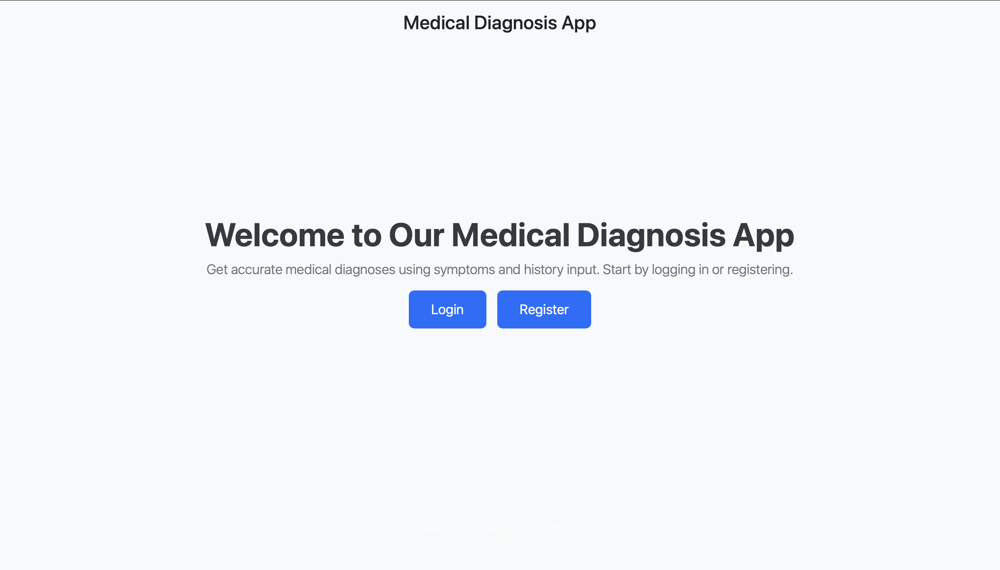
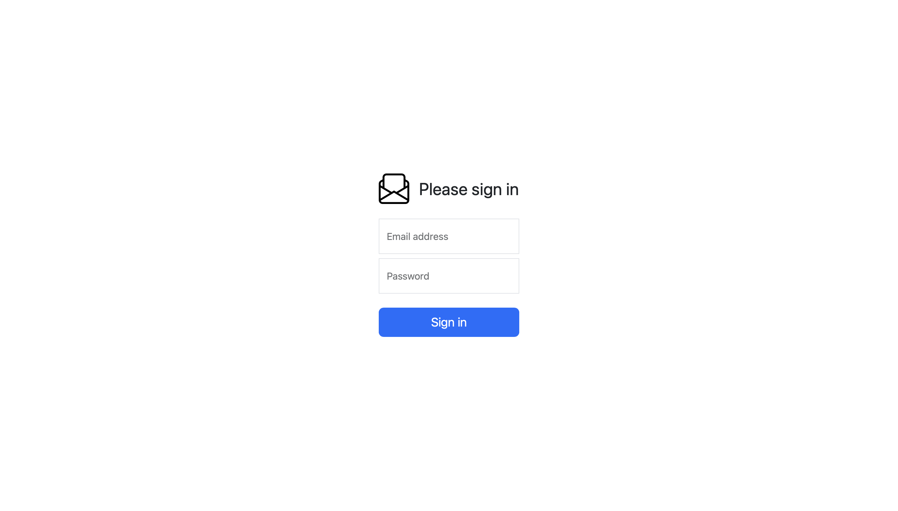
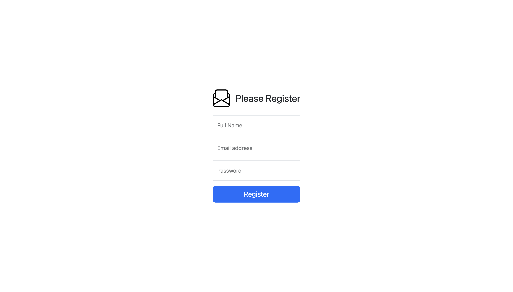
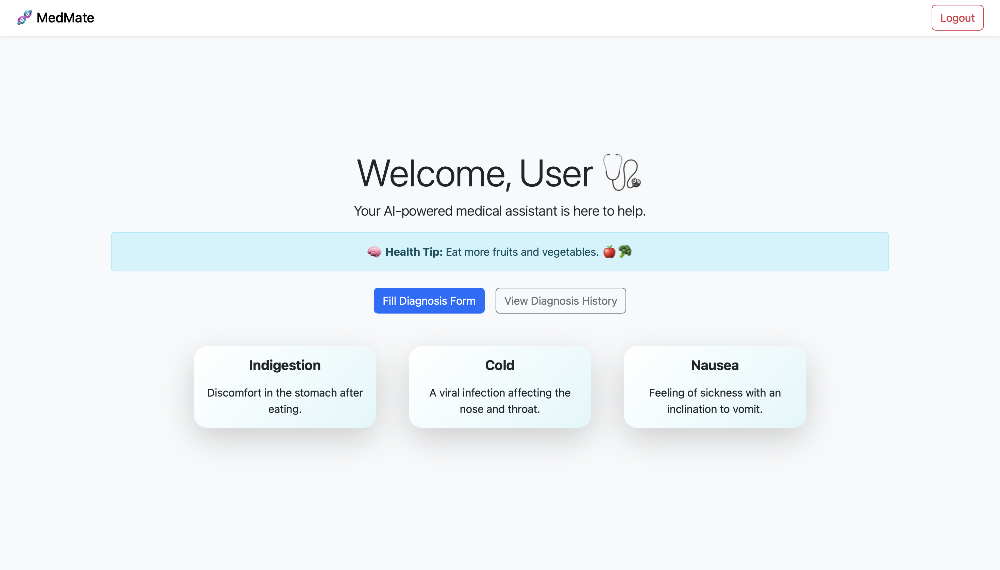
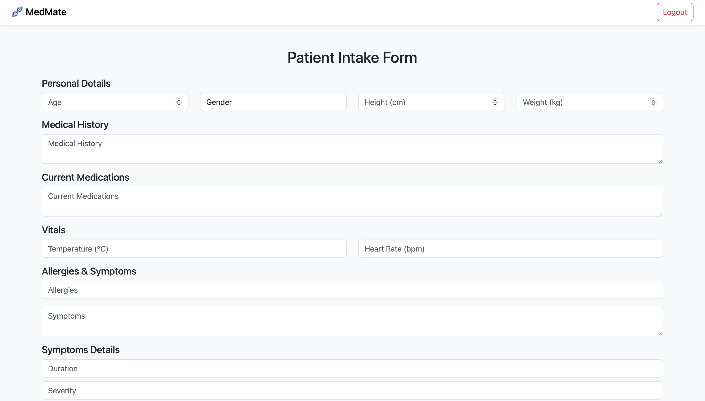
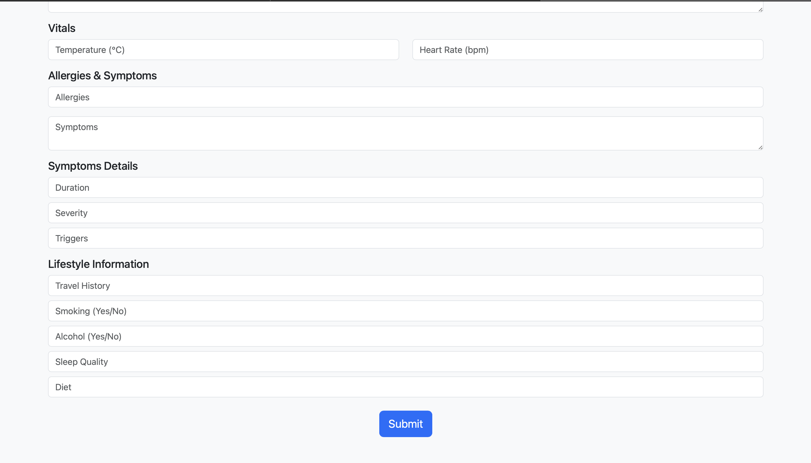
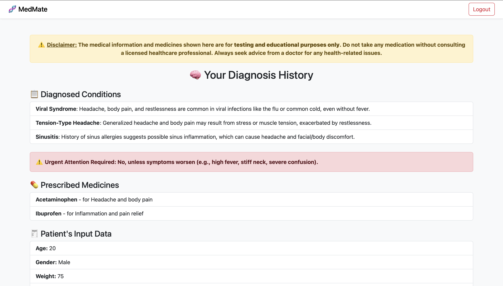
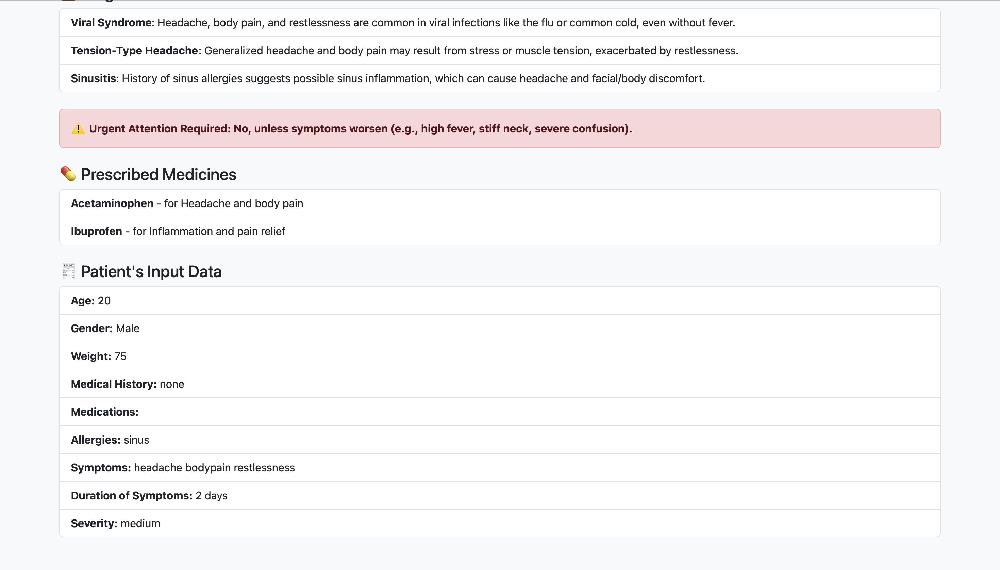

# 🩺 MedMate - AI-Powered Symptom Checker

🔗 **Live Website:** [https://med-mate-beta.vercel.app](https://med-mate-beta.vercel.app)

MedMate is a full-stack medical diagnosis web application that uses AI to analyze patient symptoms and provide preliminary diagnostic suggestions. It streamlines symptom tracking and healthcare analysis, especially for early evaluations and virtual consult assistance.

---

## 🔍 Features

- 🔐 **Authentication**
  - Secure login & registration for users
- 🏠 **Dashboard**
  - Landing interface with access to features
- 📋 **Patient Form**
  - Collects detailed patient info: age, gender, weight, symptoms, medical history, medications, allergies, lifestyle, and more
- 🤖 **AI-Based Diagnosis**
  - Processes the patient’s input through an AI-powered system and returns:
    - Possible medical conditions
    - Suggested medications
    - Urgent care alerts (if needed)
- 📊 **Diagnosis Results**
  - Neatly displays AI results to the user for further medical consideration
- ✅ **Responsive Design**
  - Built with React + Bootstrap for clean UI on all screen sizes

---

## ⚙️ Tech Stack

### 🔧 Frontend:
- React.js (with Bootstrap)
- Axios for API calls
- Vercel for deployment

### 🔧 Backend:
- Node.js + Express.js
- MongoDB (Mongoose)
- OpenAI (for diagnosis)
- Render for backend deployment

---

## 📸 Screenshots


### 🏠 Home 


### 🔑 Login Page  


---

### 📝 Register Page  


---

### 📊 Dashboard  


---

### 👨‍⚕️ Patient Form  



---

### 🧾 Diagnosis Results  



---

## 💻 How to Run Locally

### 🔽 Prerequisites
- Node.js installed
- MongoDB connection string
- OpenAI API key

---

### 📦 Backend Setup

1. **Navigate to the backend folder:**
   ```bash
   cd medmate/backend
2. **Install dependencies:**
    ```bash
    npm install
3. **Create a .env file inside the backend folder and add:**
   ```bash
   MONGO_URI=your_mongodb_connection_string
   OPENAI_API_KEY=your_openai_api_key
4. **Start the Server**
   ```bash
   npm start

 **Runs on http://localhost:5003** 

### 💻 Frontend Setup
1. **Navigate to the frontend folder:**
   ```bash
   cd medmate/frontend
2. **Install dependencies:**
   ```bash
   npm install
3. **Create a .env file inside the frontend folder and add:**
   ```bash
   REACT_APP_BACKEND_URL=http://localhost:5000
4. **Start the frontend:**
   ```bash
   npm start
**Runs on http://localhost:3000**

### 🤝 Contributing

Pull requests are welcome! For major changes, please open an issue first to discuss what you’d like to change.


                                            Made by Aryan ❤️ 